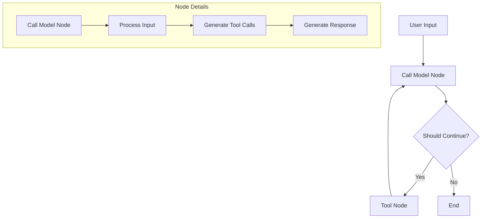

# Custom React Agent Implementation Guide

## Overview
The Custom React Agent provides a more flexible and powerful implementation that allows for complex workflows, conditional branching, and fine-grained control over tool execution. It's built using LangGraph's graph-based architecture.

## When to Use Custom React Agent
Choose the Custom React Agent when:
- You need complex decision-making logic
- You want fine-grained control over tool execution flow
- You need conditional branching based on tool results
- You're building a sophisticated agent with multiple decision paths

## Architecture


## Configuration
To use the Custom React Agent, configure your `agent.yaml` as follows:

```yaml
type: "custom_react_agent"
prompt: >-
  You are a helpful AI assistant designed to provide clear, accurate, and relevant responses.
  When answering questions:
  1. If you need more information, ask clarifying questions
  2. Break down complex topics into simpler explanations
  3. Provide specific examples when helpful
  4. Acknowledge if you're unsure about something
  5. Focus on addressing the core of the user's question

nodes:
  - name: tool_node
  - name: call_model
  - name: should_continue

entry_point: call_model

edges:
  - from: tool_node
    to: call_model

conditional_edges:
  - from: call_model
    condition: should_continue
    mapping:
      tool_node: tool_node
      end: END

tools:
  - name: tool_name
    description: "Description of what the tool does"
    arguments:
      type: object
      properties:
        arg1:
          type: string
          description: "Description of argument 1"
      required: ["arg1"]
```

## Implementation Details

### Core Components

1. **Nodes**
   - `call_model`: Processes input and generates responses/tool calls
   - `tool_node`: Executes tools and processes results
   - `should_continue`: Determines if more actions are needed

2. **Edges**
   - Define the flow between nodes
   - Support conditional routing based on node outputs

3. **Graph Structure**
   - Built using LangGraph's StateGraph
   - Maintains conversation state throughout execution

### Flow
1. User input enters through the entry point
2. Call Model node processes input
3. Should Continue node evaluates next action
4. Tool Node executes tools if needed
5. Process repeats until completion

## Example Implementation

```python
from langgraph.graph import StateGraph
from src.models.state import AgentState
from src.core.nodes import call_model, tool_node, should_continue

# Initialize the graph
workflow = StateGraph(AgentState)

# Add nodes
workflow.add_node("call_model", call_model)
workflow.add_node("tool_node", tool_node)

# Add edges
workflow.add_edge("tool_node", "call_model")

# Add conditional edges
workflow.add_conditional_edges(
    "call_model",
    should_continue,
    {
        "tool_node": "tool_node",
        "end": "END"
    }
)

# Set entry point
workflow.set_entry_point("call_model")

# Compile the graph
graph = workflow.compile()
```

## Best Practices
1. Design your graph flow carefully
2. Use meaningful node names
3. Handle edge cases in conditional logic
4. Maintain clear state management
5. Document node interactions

## Advanced Features
1. **State Management**
   - Track conversation history
   - Maintain tool execution context
   - Handle complex workflows

2. **Conditional Routing**
   - Route based on tool results
   - Handle error conditions
   - Implement retry logic

3. **Custom Node Implementation**
   - Create specialized processing nodes
   - Implement custom tool handling
   - Add monitoring and logging

## Limitations
- More complex setup than standard React Agent
- Requires understanding of graph-based workflows
- Higher maintenance overhead
