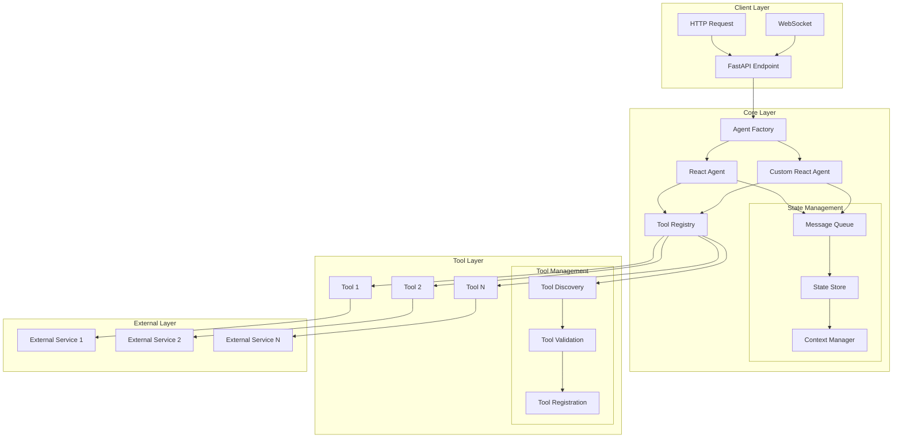
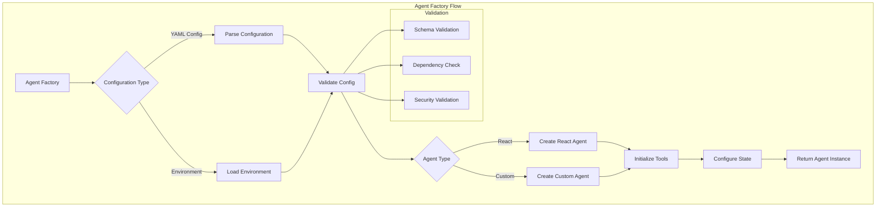
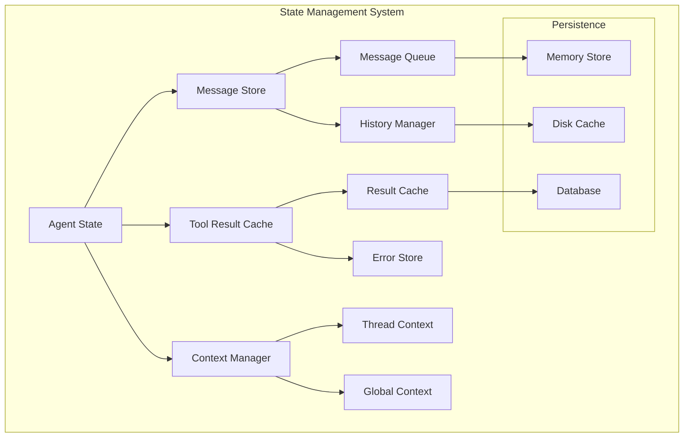
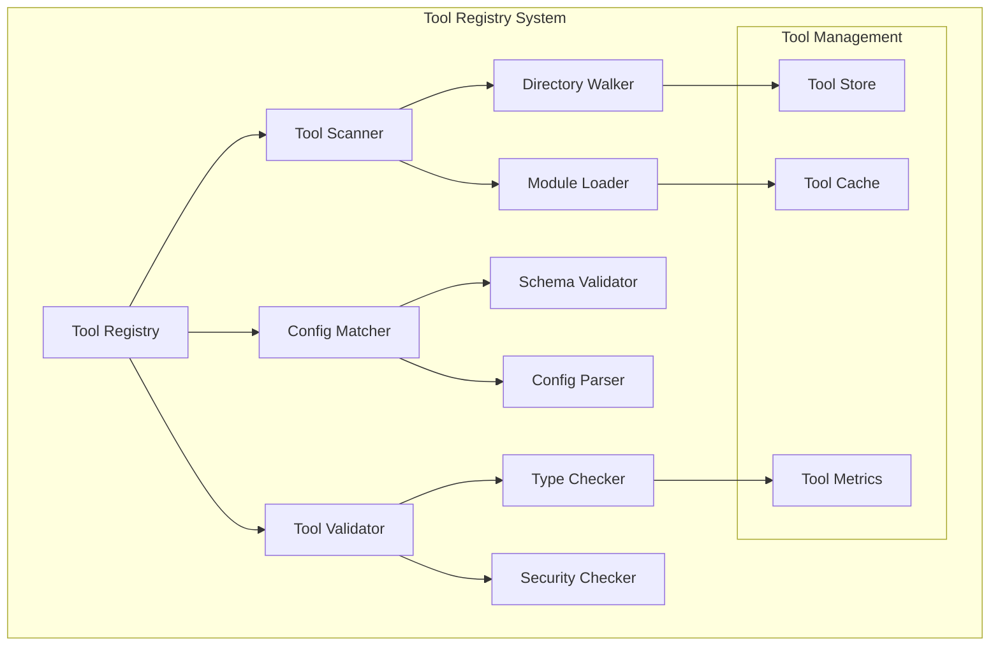
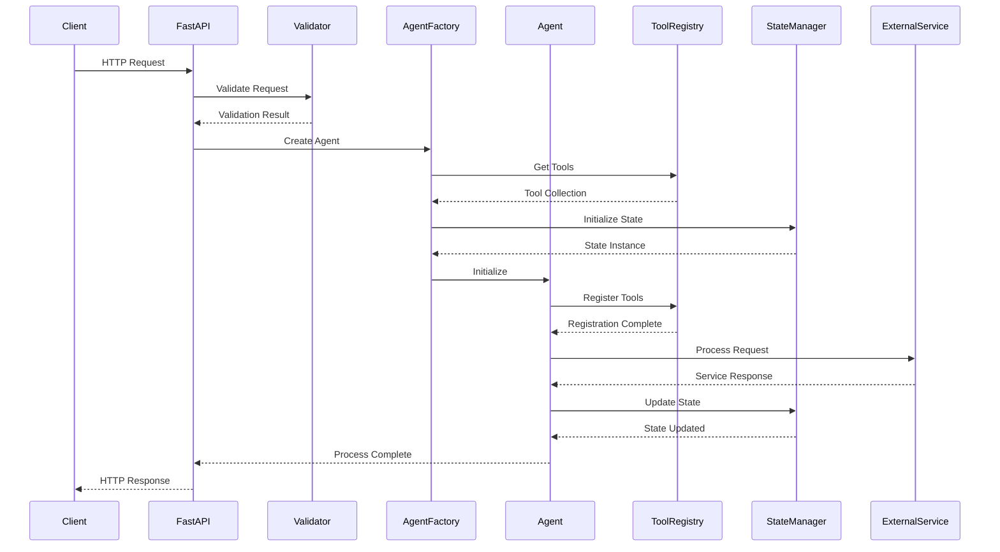
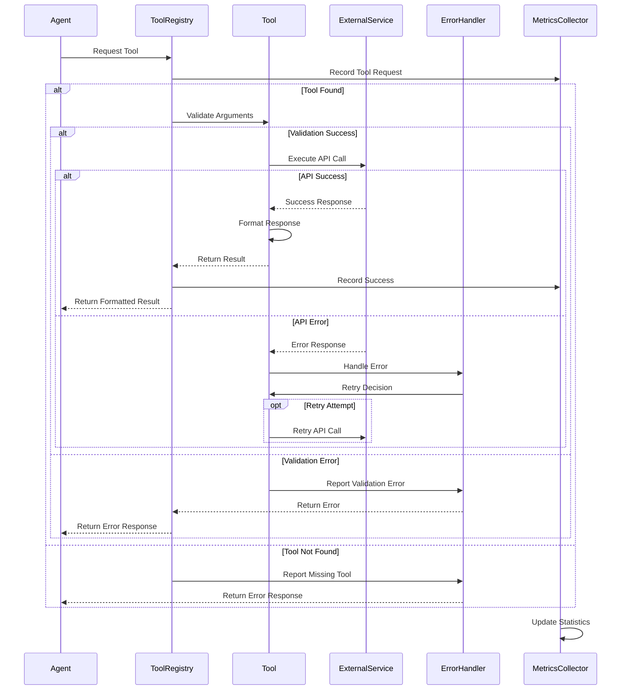

# System Architecture

## High-Level Overview

The system is built on a modular, event-driven architecture that enables flexible AI agent interactions through a standardized tool interface.



### Layer Details

#### 1. Client Layer
- **HTTP Endpoints**: RESTful API endpoints for synchronous requests
- **WebSocket Support**: Real-time bidirectional communication for streaming responses
- **Request Validation**: Pydantic models for request/response validation
- **Rate Limiting**: Request throttling and quota management

#### 2. Core Layer
- **Agent Factory**: Dynamic agent instantiation and configuration
- **State Management**: Robust state handling across agent lifecycle
- **Message Queue**: Asynchronous message processing
- **Context Management**: Thread-safe context handling

#### 3. Tool Layer
- **Tool Registry**: Centralized tool management
- **Tool Discovery**: Automatic tool detection and registration
- **Validation**: Schema validation and capability verification
- **Error Handling**: Comprehensive error management

#### 4. External Layer
- **Service Integration**: External API integration
- **Rate Limiting**: Service-specific rate limiting
- **Circuit Breaking**: Fault tolerance mechanisms
- **Retry Logic**: Automatic retry with backoff

## Core Components

### 1. Agent Factory
The Agent Factory implements the Factory pattern for dynamic agent creation and configuration.



#### Implementation Details
```python
class AgentFactory:
    def __init__(self, config: Dict[str, Any]):
        self.config = self._validate_config(config)
        self.tools = ToolRegistry.auto_register()

    def create_agent(self) -> BaseAgent:
        agent_type = self.config["type"]
        if agent_type == "react_agent":
            return self._create_react_agent()
        elif agent_type == "custom_react_agent":
            return self._create_custom_agent()
        raise ValueError(f"Unknown agent type: {agent_type}")
```

### 2. State Management
Comprehensive state management system handling message history, tool results, and context.



#### State Implementation
```python
class AgentState(MessagesState):
    def __init__(self):
        self.messages: List[Message] = []
        self.tool_results: Dict[str, Any] = {}
        self.context: Dict[str, Any] = {}
        self._message_queue = asyncio.Queue()
        self._result_cache = Cache()

    async def add_message(self, message: Message):
        await self._message_queue.put(message)
        self.messages.append(message)
        await self._persist_message(message)
```

### 3. Tool System
Detailed breakdown of the tool system architecture and implementation.



#### Tool Registration Process
```python
class ToolRegistry:
    def __init__(self):
        self.tools: Dict[str, BaseTool] = {}
        self.tool_specs: Dict[str, Dict] = {}
        self._metrics = MetricsCollector()

    async def register_tool(self, tool: BaseTool):
        """
        Register a tool with validation and metrics collection.

        Args:
            tool (BaseTool): Tool instance to register

        Raises:
            ToolValidationError: If tool fails validation
            ToolRegistrationError: If registration fails
        """
        try:
            # Validate tool
            await self._validate_tool(tool)

            # Register tool
            self.tools[tool.name] = tool
            self.tool_specs[tool.name] = tool.get_spec()

            # Initialize metrics
            self._metrics.register_tool(tool.name)

            logger.info(f"Successfully registered tool: {tool.name}")
        except Exception as e:
            logger.error(f"Failed to register tool {tool.name}: {e}")
            raise ToolRegistrationError(f"Tool registration failed: {e}")
```

## Data Flow

### 1. Request Processing
Detailed sequence diagram showing the complete request processing flow.



## Configuration

### 1. Environment Variables
```env
LITELLM_GATEWAY_URL=your_gateway_url
LITELLM_GATEWAY_API_KEY=your_api_key
LOG_LEVEL=INFO
```

### 2. Agent Configuration (`agent.yaml`)
- Agent type selection
- Tool specifications
- Prompt configuration
- Graph structure (for custom agent)

## Security Considerations

### 1. API Security
- Gateway authentication
- API key management
- Request validation

### 2. Tool Security
- Input validation
- Error handling
- Resource limits

### 3. Data Security
- Sensitive data handling
- Response sanitization
- Logging security

## Error Handling

### 1. Application Level
- Global exception handling
- HTTP error responses
- Validation errors

### 2. Agent Level
- Tool execution errors
- State management errors
- Configuration errors

### 3. Tool Level
- Input validation
- External service errors
- Resource errors

## Monitoring and Logging

### 1. Logging System
- Structured logging
- Log levels
- Error tracking

### 2. Metrics
- Tool usage
- Response times
- Error rates

### 3. Debugging
- Debug mode
- Detailed logging
- State inspection

## Best Practices

### 1. Development
- Modular design
- Clear separation of concerns
- Comprehensive documentation
- Type hints and validation

### 2. Deployment
- Environment configuration
- Dependency management
- Version control
- CI/CD integration

### 3. Maintenance
- Code quality
- Testing
- Documentation updates
- Security updates

## Extension Points

### 1. New Agent Types
- Implement new agent classes
- Add to agent factory
- Update configuration

### 2. New Tools
- Create tool implementation
- Add configuration
- Register with system

### 3. Custom Functionality
- Add new nodes
- Extend graph structure
- Implement custom logic

### 2. Tool Execution
Detailed sequence diagram showing the complete tool execution flow with error handling and retries.



## Configuration Management

### 1. Environment Configuration
Detailed environment configuration with validation and defaults.

```python
from pydantic_settings import BaseSettings, SettingsConfigDict
from typing import Optional
import yaml
from pathlib import Path

class EnvironmentSettings(BaseSettings):
    """
    Environment configuration with validation and documentation.
    """
    # LiteLLM Configuration
    LITELLM_GATEWAY_URL: str
    LITELLM_GATEWAY_API_KEY: str

    # Logging Configuration
    LOG_LEVEL: str = "INFO"
    LOG_FORMAT: str = "%(asctime)s - %(name)s - %(levelname)s - %(message)s"

    # Application Configuration
    MAX_RETRIES: int = 3
    TIMEOUT_SECONDS: int = 30
    BATCH_SIZE: int = 100

    # Security Configuration
    ENABLE_SSL: bool = True
    SSL_CERT_PATH: Optional[Path] = None
    SSL_KEY_PATH: Optional[Path] = None

    # Cache Configuration
    ENABLE_CACHE: bool = True
    CACHE_TTL: int = 3600

    # Rate Limiting
    RATE_LIMIT_ENABLED: bool = True
    RATE_LIMIT_REQUESTS: int = 100
    RATE_LIMIT_PERIOD: int = 60

    @property
    def ssl_configured(self) -> bool:
        """Check if SSL is properly configured."""
        return self.ENABLE_SSL and self.SSL_CERT_PATH and self.SSL_KEY_PATH

    class Config:
        env_file = ".env"
        case_sensitive = True
```

### 2. YAML Configuration Parser
Advanced YAML configuration parser with schema validation and error handling.

```python
from typing import Dict, Any
import yaml
from pydantic import BaseModel, Field
from pathlib import Path

class ToolConfig(BaseModel):
    """Tool configuration schema."""
    name: str = Field(..., description="Unique identifier for the tool")
    description: str = Field(..., description="Clear description of tool's purpose")
    arguments: Dict[str, Any] = Field(default_factory=dict)
    required: list = Field(default_factory=list)

class AgentConfig(BaseModel):
    """Agent configuration schema."""
    type: str = Field(..., description="Type of agent (react_agent or custom_react_agent)")
    prompt: str = Field(..., description="System prompt for the agent")
    tools: List[ToolConfig] = Field(default_factory=list)

    class Config:
        extra = "forbid"

class ConfigurationManager:
    """
    Manages loading and validation of YAML configurations.
    """
    def __init__(self, config_path: Path):
        self.config_path = config_path
        self.config: Dict[str, Any] = {}
        self._load_config()

    def _load_config(self):
        """Load and validate configuration file."""
        try:
            with open(self.config_path) as f:
                self.config = yaml.safe_load(f)
            self._validate_config()
        except Exception as e:
            logger.error(f"Failed to load configuration: {e}")
            raise ConfigurationError(f"Configuration loading failed: {e}")

    def _validate_config(self):
        """Validate configuration against schema."""
        try:
            AgentConfig(**self.config)
        except ValidationError as e:
            logger.error(f"Configuration validation failed: {e}")
            raise ConfigurationError(f"Configuration validation failed: {e}")
```

## Security Implementation

### 1. Authentication Middleware
Implementation of authentication middleware with JWT support.

```python
from fastapi import Request, HTTPException
from jose import JWTError, jwt
from datetime import datetime, timedelta
from typing import Optional

class SecurityManager:
    """
    Manages security aspects of the application.
    """
    def __init__(self, secret_key: str, algorithm: str = "HS256"):
        self.secret_key = secret_key
        self.algorithm = algorithm

    async def create_access_token(
        self,
        data: dict,
        expires_delta: Optional[timedelta] = None
    ) -> str:
        """Create JWT token with expiration."""
        to_encode = data.copy()
        if expires_delta:
            expire = datetime.utcnow() + expires_delta
        else:
            expire = datetime.utcnow() + timedelta(minutes=15)
        to_encode.update({"exp": expire})
        return jwt.encode(to_encode, self.secret_key, algorithm=self.algorithm)

    async def verify_token(self, token: str) -> dict:
        """Verify JWT token and return payload."""
        try:
            payload = jwt.decode(token, self.secret_key, algorithms=[self.algorithm])
            return payload
        except JWTError:
            raise HTTPException(
                status_code=401,
                detail="Could not validate credentials"
            )

class AuthMiddleware:
    """
    Authentication middleware for FastAPI.
    """
    def __init__(self, security_manager: SecurityManager):
        self.security_manager = security_manager

    async def __call__(self, request: Request, call_next):
        try:
            token = request.headers["Authorization"].split(" ")[1]
            payload = await self.security_manager.verify_token(token)
            request.state.user = payload
        except (KeyError, IndexError):
            raise HTTPException(
                status_code=401,
                detail="Invalid authentication credentials"
            )
        return await call_next(request)
```

### 2. Rate Limiting Implementation
Sophisticated rate limiting with Redis backend.

```python
from fastapi import Request, HTTPException
import asyncio
from redis.asyncio import Redis
from datetime import datetime

class RateLimiter:
    """
    Rate limiting implementation using Redis.
    """
    def __init__(
        self,
        redis: Redis,
        requests: int,
        window: int
    ):
        self.redis = redis
        self.requests = requests
        self.window = window

    async def is_rate_limited(self, key: str) -> bool:
        """
        Check if request should be rate limited.

        Args:
            key: Unique identifier for the client

        Returns:
            bool: True if request should be limited
        """
        pipeline = self.redis.pipeline()
        now = datetime.utcnow().timestamp()
        window_start = now - self.window

        # Remove old requests
        await pipeline.zremrangebyscore(key, 0, window_start)

        # Count requests in current window
        await pipeline.zcard(key)

        # Add current request
        await pipeline.zadd(key, {str(now): now})

        # Set expiry on the key
        await pipeline.expire(key, self.window)

        _, current_requests, *_ = await pipeline.execute()

        return current_requests > self.requests

class RateLimitMiddleware:
    """
    Rate limiting middleware for FastAPI.
    """
    def __init__(self, limiter: RateLimiter):
        self.limiter = limiter

    async def __call__(self, request: Request, call_next):
        client_ip = request.client.host

        if await self.limiter.is_rate_limited(client_ip):
            raise HTTPException(
                status_code=429,
                detail="Too many requests"
            )

        return await call_next(request)
```

## Error Handling Implementation

### 1. Custom Error Types
Hierarchy of custom error types for different scenarios.

```python
class BaseError(Exception):
    """Base error class for the application."""
    def __init__(self, message: str, status_code: int = 500):
        self.message = message
        self.status_code = status_code
        super().__init__(self.message)

class ConfigurationError(BaseError):
    """Raised when there's an error in configuration."""
    def __init__(self, message: str):
        super().__init__(message, status_code=500)

class ToolError(BaseError):
    """Base class for tool-related errors."""
    pass

class ToolNotFoundError(ToolError):
    """Raised when a requested tool is not found."""
    def __init__(self, tool_name: str):
        message = f"Tool not found: {tool_name}"
        super().__init__(message, status_code=404)

class ToolExecutionError(ToolError):
    """Raised when a tool execution fails."""
    def __init__(self, tool_name: str, reason: str):
        message = f"Tool execution failed: {tool_name}. Reason: {reason}"
        super().__init__(message, status_code=500)

class ValidationError(BaseError):
    """Raised when validation fails."""
    def __init__(self, message: str):
        super().__init__(message, status_code=400)
```

### 2. Global Exception Handler
Comprehensive exception handling middleware.

```python
from fastapi import Request, Response
from fastapi.responses import JSONResponse
import traceback

async def global_exception_handler(request: Request, exc: Exception) -> Response:
    """
    Global exception handler for all unhandled exceptions.

    Args:
        request: FastAPI request object
        exc: The raised exception

    Returns:
        JSONResponse with error details
    """
    error_id = str(uuid.uuid4())

    if isinstance(exc, BaseError):
        # Handle known application errors
        logger.error(
            f"Application error: {exc.message}",
            extra={
                "error_id": error_id,
                "status_code": exc.status_code,
                "path": request.url.path
            }
        )
        return JSONResponse(
            status_code=exc.status_code,
            content={
                "error": exc.message,
                "error_id": error_id
            }
        )

    # Handle unexpected errors
    logger.error(
        f"Unexpected error: {str(exc)}",
        extra={
            "error_id": error_id,
            "traceback": traceback.format_exc(),
            "path": request.url.path
        }
    )

    return JSONResponse(
        status_code=500,
        content={
            "error": "An unexpected error occurred",
            "error_id": error_id
        }
    )
```

## Monitoring and Metrics

### 1. Metrics Collection
Implementation of metrics collection system.

```python
from dataclasses import dataclass, field
from datetime import datetime
from typing import Dict, List
import statistics

@dataclass
class ToolMetrics:
    """Metrics for individual tools."""
    name: str
    calls: int = 0
    errors: int = 0
    total_duration: float = 0.0
    durations: List[float] = field(default_factory=list)

    @property
    def average_duration(self) -> float:
        """Calculate average duration of tool calls."""
        return statistics.mean(self.durations) if self.durations else 0.0

    @property
    def error_rate(self) -> float:
        """Calculate error rate as percentage."""
        return (self.errors / self.calls * 100) if self.calls > 0 else 0.0

class MetricsCollector:
    """
    Collects and manages metrics for the application.
    """
    def __init__(self):
        self.tool_metrics: Dict[str, ToolMetrics] = {}
        self.start_time = datetime.utcnow()

    def register_tool(self, tool_name: str):
        """Register a new tool for metrics collection."""
        if tool_name not in self.tool_metrics:
            self.tool_metrics[tool_name] = ToolMetrics(name=tool_name)

    async def record_tool_call(
        self,
        tool_name: str,
        duration: float,
        success: bool
    ):
        """Record metrics for a tool call."""
        if tool_name not in self.tool_metrics:
            self.register_tool(tool_name)

        metrics = self.tool_metrics[tool_name]
        metrics.calls += 1
        metrics.total_duration += duration
        metrics.durations.append(duration)

        if not success:
            metrics.errors += 1

    def get_metrics(self) -> Dict[str, Dict]:
        """Get current metrics for all tools."""
        return {
            name: {
                "calls": metrics.calls,
                "errors": metrics.errors,
                "error_rate": metrics.error_rate,
                "average_duration": metrics.average_duration
            }
            for name, metrics in self.tool_metrics.items()
        }
```

### 2. Logging System
Advanced logging configuration with structured logging support.

```python
import logging
import json
from datetime import datetime
from typing import Any, Dict

class StructuredLogger:
    """
    Structured logging implementation with JSON output.
    """
    def __init__(self, name: str, level: str = "INFO"):
        self.logger = logging.getLogger(name)
        self.logger.setLevel(level)

        # Add JSON handler
        handler = logging.StreamHandler()
        handler.setFormatter(self.JsonFormatter())
        self.logger.addHandler(handler)

    class JsonFormatter(logging.Formatter):
        """JSON formatter for structured logging."""
        def format(self, record: logging.LogRecord) -> str:
            log_data = {
                "timestamp": datetime.utcnow().isoformat(),
                "level": record.levelname,
                "message": record.getMessage(),
                "module": record.module,
                "function": record.funcName,
                "line": record.lineno
            }

            # Add extra fields if available
            if hasattr(record, "extra"):
                log_data.update(record.extra)

            return json.dumps(log_data)

    def _log(self, level: str, message: str, extra: Dict[str, Any] = None):
        """Internal logging method."""
        if extra is None:
            extra = {}

        self.logger.log(
            logging.getLevelName(level),
            message,
            extra={"extra": extra}
        )

    def info(self, message: str, **kwargs):
        """Log info level message."""
        self._log("INFO", message, kwargs)

    def error(self, message: str, **kwargs):
        """Log error level message."""
        self._log("ERROR", message, kwargs)

    def debug(self, message: str, **kwargs):
        """Log debug level message."""
        self._log("DEBUG", message, kwargs)

    def warning(self, message: str, **kwargs):
        """Log warning level message."""
        self._log("WARNING", message, kwargs)
```

## Testing Implementation

### 1. Unit Tests
Example of comprehensive unit testing implementation.

```python
import pytest
from unittest.mock import Mock, patch
from src.tools import ToolRegistry
from src.core.agents import AgentFactory

class TestToolRegistry:
    """Test suite for Tool Registry."""

    @pytest.fixture
    def tool_registry(self):
        """Create a tool registry instance for testing."""
        return ToolRegistry()

    @pytest.fixture
    def mock_tool(self):
        """Create a mock tool for testing."""
        tool = Mock()
        tool.name = "test_tool"
        tool.description = "Test tool"
        return tool

    async def test_register_tool(self, tool_registry, mock_tool):
        """Test tool registration."""
        await tool_registry.register_tool(mock_tool)
        assert mock_tool.name in tool_registry.tools
        assert tool_registry.tools[mock_tool.name] == mock_tool

    async def test_register_invalid_tool(self, tool_registry):
        """Test registration of invalid tool."""
        with pytest.raises(ToolValidationError):
            await tool_registry.register_tool(None)

class TestAgentFactory:
    """Test suite for Agent Factory."""

    @pytest.fixture
    def config(self):
        """Create test configuration."""
        return {
            "type": "react_agent",
            "prompt": "Test prompt",
            "tools": []
        }

    async def test_create_react_agent(self, config):
        """Test creation of react agent."""
        factory = AgentFactory(config)
        agent = await factory.create_agent()
        assert agent.type == "react_agent"

    async def test_create_invalid_agent(self, config):
        """Test creation with invalid agent type."""
        config["type"] = "invalid"
        with pytest.raises(ValueError):
            factory = AgentFactory(config)
            await factory.create_agent()
```

### 2. Integration Tests
Example of integration testing implementation.

```python
import pytest
from fastapi.testclient import TestClient
from src.main import app

class TestAPI:
    """Integration tests for the API."""

    @pytest.fixture
    def client(self):
        """Create test client."""
        return TestClient(app)

    async def test_process_request(self, client):
        """Test complete request processing."""
        response = client.post(
            "/process",
            json={
                "thread_id": "test_thread",
                "user_input": "Test input"
            }
        )
        assert response.status_code == 200
        assert "response" in response.json()

    async def test_tool_execution(self, client):
        """Test tool execution through API."""
        response = client.post(
            "/execute_tool",
            json={
                "tool_name": "get_username",
                "arguments": {}
            }
        )
        assert response.status_code == 200
        assert "response" in response.json()
```

## Deployment Configuration

### 1. Docker Configuration
Example Dockerfile and docker-compose configuration.

```dockerfile
# Dockerfile
FROM python:3.9-slim

# Set working directory
WORKDIR /app

# Install poetry
RUN pip install poetry

# Copy project files
COPY pyproject.toml poetry.lock ./
COPY src/ ./src/
COPY agent.yaml ./

# Install dependencies
RUN poetry config virtualenvs.create false \
    && poetry install --no-dev

# Run the application
CMD ["poetry", "run", "uvicorn", "src.main:app", "--host", "0.0.0.0", "--port", "8000"]
```

```yaml
# docker-compose.yaml
version: '3.8'

services:
  app:
    build: .
    ports:
      - "8000:8000"
    environment:
      - LITELLM_GATEWAY_URL=${LITELLM_GATEWAY_URL}
      - LITELLM_GATEWAY_API_KEY=${LITELLM_GATEWAY_API_KEY}
      - LOG_LEVEL=INFO
    volumes:
      - ./agent.yaml:/app/agent.yaml
    depends_on:
      - redis

  redis:
    image: redis:alpine
    ports:
      - "6379:6379"
```

## Performance Optimization

### 1. Caching Implementation
Example of caching implementation for tool results.

```python
from typing import Any, Optional
from datetime import datetime, timedelta
import asyncio

class CacheEntry:
    """
    Represents a cached item with expiration.
    """
    def __init__(self, value: Any, ttl: int):
        self.value = value
        self.expiry = datetime.utcnow() + timedelta(seconds=ttl)

    @property
    def is_expired(self) -> bool:
        """Check if the cache entry has expired."""
        return datetime.utcnow() > self.expiry

class Cache:
    """
    Thread-safe cache implementation with TTL support.
    """
    def __init__(self, default_ttl: int = 3600):
        self._cache: Dict[str, CacheEntry] = {}
        self._lock = asyncio.Lock()
        self._default_ttl = default_ttl

    async def get(self, key: str) -> Optional[Any]:
        """
        Get value from cache if it exists and hasn't expired.
        """
        async with self._lock:
            entry = self._cache.get(key)
            if entry and not entry.is_expired:
                return entry.value
            if entry:
                del self._cache[key]
            return None

    async def set(self, key: str, value: Any, ttl: Optional[int] = None):
        """
        Set value in cache with optional TTL.
        """
        async with self._lock:
            self._cache[key] = CacheEntry(
                value,
                ttl or self._default_ttl
            )

    async def delete(self, key: str):
        """
        Delete value from cache.
        """
        async with self._lock:
            self._cache.pop(key, None)

    async def cleanup(self):
        """
        Remove expired entries from cache.
        """
        async with self._lock:
            now = datetime.utcnow()
            expired_keys = [
                k for k, v in self._cache.items()
                if v.is_expired
            ]
            for k in expired_keys:
                del self._cache[k]
```

### 2. Connection Pooling
Example of connection pooling implementation.

```python
from typing import Dict, Set
import aiohttp
import asyncio
from contextlib import asynccontextmanager

class ConnectionPool:
    """
    Manages a pool of connections to external services.
    """
    def __init__(
        self,
        max_connections: int = 100,
        timeout: int = 30
    ):
        self._max_connections = max_connections
        self._timeout = timeout
        self._pools: Dict[str, aiohttp.ClientSession] = {}
        self._locks: Dict[str, asyncio.Lock] = {}
        self._active_connections: Dict[str, Set[str]] = {}

    @asynccontextmanager
    async def get_connection(self, service_url: str):
        """
        Get a connection from the pool.
        """
        if service_url not in self._pools:
            self._pools[service_url] = aiohttp.ClientSession(
                timeout=aiohttp.ClientTimeout(total=self._timeout)
            )
            self._locks[service_url] = asyncio.Lock()
            self._active_connections[service_url] = set()

        async with self._locks[service_url]:
            if len(self._active_connections[service_url]) >= self._max_connections:
                raise ConnectionError("Connection pool exhausted")

            conn_id = str(uuid.uuid4())
            self._active_connections[service_url].add(conn_id)

        try:
            yield self._pools[service_url]
        finally:
            async with self._locks[service_url]:
                self._active_connections[service_url].remove(conn_id)

    async def close(self):
        """
        Close all connection pools.
        """
        for session in self._pools.values():
            await session.close()
        self._pools.clear()
        self._active_connections.clear()
```

This completes the comprehensive architecture documentation with detailed implementations, examples, and best practices for each component of the system.
