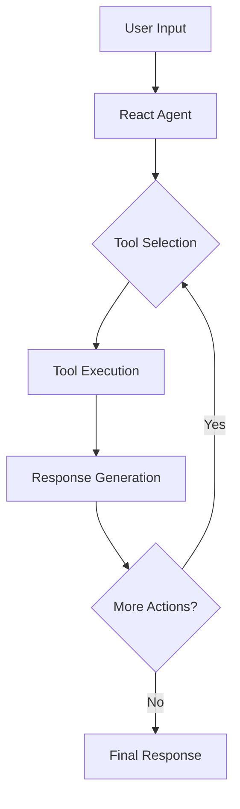

# React Agent with MCP Implementation Guide

## Overview

The React Agent is a standard implementation based on LangGraph's React pattern. It provides a simpler, more straightforward approach for building agents that need to interact with tools in a sequential manner. This implementation also includes MCP servers for tool execution.

## When to Use React Agent

Choose the React Agent when:

- You need a simple, sequential tool execution flow
- You don't need complex branching or conditional tool execution
- You want a lightweight implementation with minimal boilerplate

## Architecture



## Configuration

To use the React Agent, configure your `agent.yaml` as follows:

```yaml
type: "react_agent"
prompt: >-
  You are a helpful AI assistant designed to provide clear, accurate, and relevant responses.
  When answering questions:
  1. If you need more information, ask clarifying questions
  2. Break down complex topics into simpler explanations
  3. Provide specific examples when helpful
  4. Acknowledge if you're unsure about something
  5. Focus on addressing the core of the user's question

tools:
  - name: tool_name
    description: "Description of what the tool does"
    arguments:
      type: object
      properties:
        arg1:
          type: string
        arg2:
          type: integer

mcp_servers:
  # type: python / url
  - type: python
    name: math_server
    # path to the python file that contains the MCP server
    # Ideally, store all local MCP servers in the src/mcp_servers folder
    path: src.mcp_servers.math_server
  # - type: url
  #   name: weather_server
  #   url: http://localhost:8000/sse

checkpointer:
  type: "in_memory"
  kwargs: {}
```

## Implementation Details

### Core Components

1. **Agent Configuration**: Defined in `agent.yaml`
2. **Tool Registry**: Automatically loads tools specified in configuration
3. **Response Generation**: Handles the agent's responses and tool interactions
4. **Checkpointer**
   - Used to save and restore agent state
   - Supports in-memory or redis backend
5. **MCP Servers**
   - Used to execute tools
   - Supports python or url backend

### Flow

1. User input is received
2. Agent processes the input and determines required tools
3. Tools are executed sequentially
4. Agent generates final response

## Example Implementation

```python
from langchain_openai import ChatOpenAI
from src.tools import TOOLS

# Initialize the React agent
model = ChatOpenAI(
    model="gpt-4",
    temperature=0
)

# Bind tools to the model
tool_enabled_model = model.bind_tools(TOOLS)
```

## Best Practices

1. Keep tool descriptions clear and specific
2. Provide comprehensive argument descriptions
3. Use meaningful tool names
4. Document tool requirements and dependencies

## Limitations

- Sequential execution only
- No complex branching logic
- Limited control over tool execution flow
